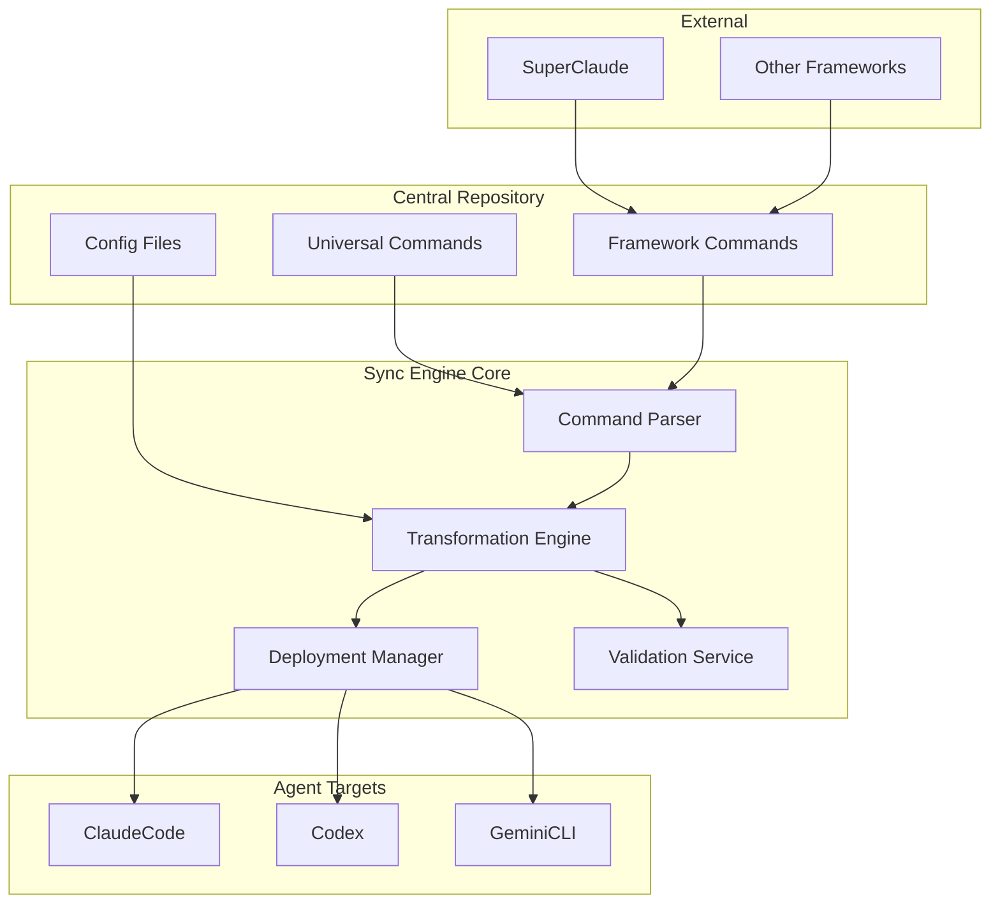
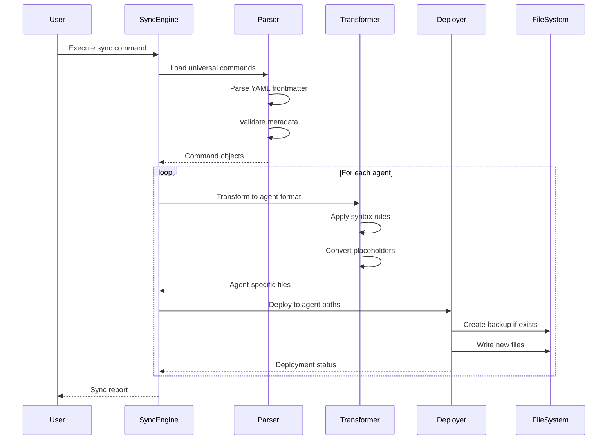
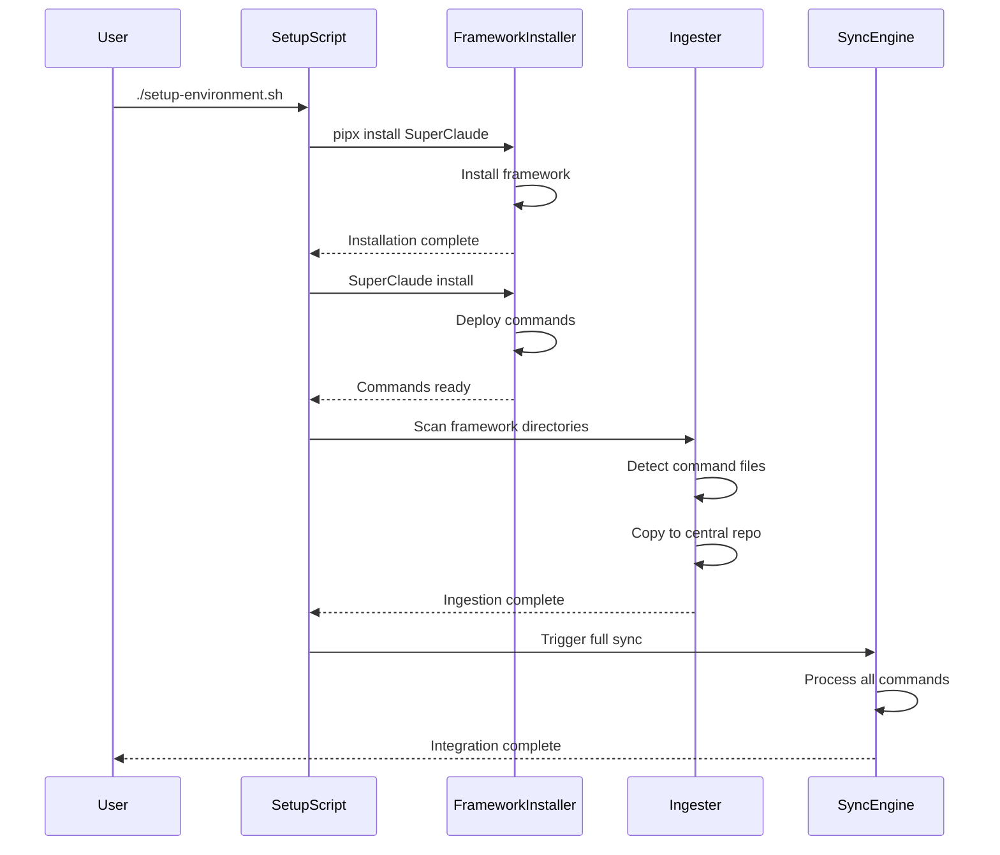
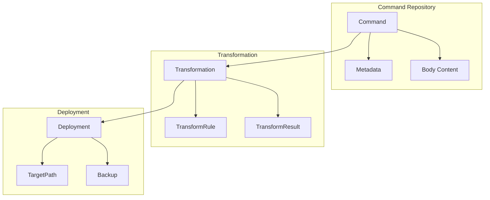
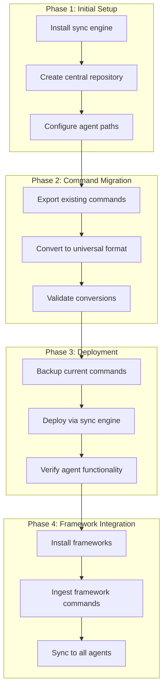

# Technical Design

## Overview

**Purpose**: This feature delivers a unified command management system to developers working with multiple AI agent CLIs.

**Users**: Polyglot AI developers will utilize this for maintaining consistent command definitions across ClaudeCode, Codex, and GeminiCLI environments.

**Impact**: Changes the current fragmented command ecosystem by establishing a single source of truth for command definitions with automated transformation and deployment capabilities.

### Goals
- Eliminate redundant command definitions across AI agents
- Automate format transformation between incompatible CLI systems
- Enable seamless integration of third-party frameworks
- Maintain consistency while respecting agent-specific capabilities

### Non-Goals
- MCP server implementation (deferred to Phase 2)
- Perfect automatic transformation for all edge cases
- Symbolic link based sharing approaches
- Real-time command synchronization

## Architecture

### High-Level Architecture



**Architecture Integration**:
- Existing patterns preserved: File-based command systems, directory structure conventions
- New components rationale: Centralized management reduces duplication, automated transformation ensures consistency
- Technology alignment: Python ecosystem aligns with existing CLI tools and scripting requirements
- Steering compliance: Modular design enables future MCP migration

### Technology Stack and Design Decisions

**Technology Stack**:
- **Language**: Python 3.10+ - Superior file manipulation, YAML/TOML support, subprocess management
- **Command Parsing**: PyYAML - Industry standard for YAML frontmatter processing
- **Format Generation**: toml (stdlib), Markdown templating via string operations
- **CLI Framework**: Typer - Type-safe, intuitive CLI construction with automatic help generation
- **Path Management**: pathlib (stdlib) - OS-agnostic path operations for complex directory structures

**Key Design Decisions**:

1. **Decision**: Universal source format as Markdown with YAML frontmatter
   - **Context**: Need single format readable by humans and parseable by machines
   - **Alternatives**: Pure YAML, JSON, TOML-only
   - **Selected Approach**: Markdown body with YAML metadata header
   - **Rationale**: Maintains human readability while providing structured metadata
   - **Trade-offs**: Gain unified format, sacrifice native agent format authoring

2. **Decision**: Transformation pipeline over runtime translation
   - **Context**: Commands must work offline and without sync engine running
   - **Alternatives**: Runtime proxy, symbolic links, MCP server
   - **Selected Approach**: Pre-generate agent-specific files during sync
   - **Rationale**: Zero runtime overhead, works with existing agent implementations
   - **Trade-offs**: Gain reliability and performance, sacrifice real-time updates

3. **Decision**: Best-effort transformation with warning system
   - **Context**: Agent capabilities vary significantly (especially for third-party commands)
   - **Alternatives**: Strict validation with failure, lowest common denominator
   - **Selected Approach**: Transform what's possible, warn about incompatibilities
   - **Rationale**: Maximizes utility while being transparent about limitations
   - **Trade-offs**: Gain flexibility, sacrifice guaranteed compatibility

## System Flows

### Command Synchronization Flow



### Third-Party Framework Integration Flow



## Requirements Traceability

| Requirement | Summary | Components | Interfaces | Flows |
|-------------|---------|------------|------------|-------|
| 1.1-1.5 | Universal command storage | Command Parser | parse_frontmatter(), validate_metadata() | Command Synchronization |
| 2.1-2.5 | Agent format transformation | Transformation Engine | transform_to_claude(), transform_to_codex(), transform_to_gemini() | Command Synchronization |
| 3.1-3.5 | Deployment scope management | Deployment Manager | deploy_to_scope(), create_directory_structure() | Command Synchronization |
| 4.1-4.5 | Third-party integration | Framework Ingester | install_framework(), ingest_commands() | Framework Integration |
| 5.1-5.5 | Sync execution | Sync Engine Core | execute_sync(), handle_conflicts() | Both flows |
| 6.1-6.5 | Validation | Validation Service | validate_yaml(), check_shell_safety() | Command Synchronization |
| 7.1-7.5 | Configuration | Config Manager | load_config(), apply_custom_rules() | Command Synchronization |
| 8.1-8.5 | Monitoring | Report Generator | generate_logs(), create_summary() | Both flows |

## Components and Interfaces

### Core Engine

#### Sync Engine

**Responsibility & Boundaries**
- **Primary Responsibility**: Orchestrates the complete synchronization workflow from parsing to deployment
- **Domain Boundary**: Command synchronization domain
- **Data Ownership**: Synchronization state, operation history, error logs
- **Transaction Boundary**: Complete sync operation (all-or-nothing per agent)

**Dependencies**
- **Inbound**: CLI interface, setup scripts
- **Outbound**: All other core components
- **External**: File system, subprocess for external commands

**Service Interface**
```typescript
interface SyncEngineService {
  executeSync(options: SyncOptions): Result<SyncReport, SyncError>;
  validateEnvironment(): Result<EnvironmentStatus, ValidationError>;
  rollbackSync(agentId: string): Result<void, RollbackError>;
}

interface SyncOptions {
  scope: 'user' | 'project' | 'all';
  agents: string[];
  dryRun: boolean;
  verbose: boolean;
}

interface SyncReport {
  processedCommands: number;
  successfulTransformations: Map<string, number>;
  warnings: Warning[];
  errors: Error[];
  duration: number;
}
```

#### Command Parser

**Responsibility & Boundaries**
- **Primary Responsibility**: Parse and validate universal command format files
- **Domain Boundary**: Command definition domain
- **Data Ownership**: Parsed command structures, metadata schemas
- **Transaction Boundary**: Individual file parsing

**Dependencies**
- **Inbound**: Sync Engine
- **Outbound**: File system
- **External**: PyYAML library

**Service Interface**
```typescript
interface CommandParserService {
  parseCommand(filePath: string): Result<UniversalCommand, ParseError>;
  validateMetadata(metadata: CommandMetadata): Result<void, ValidationError>;
  extractFrontmatter(content: string): Result<CommandMetadata, ParseError>;
}

interface UniversalCommand {
  metadata: CommandMetadata;
  body: string;
  sourcePath: string;
}

interface CommandMetadata {
  name: string;
  description: string;
  scope: 'user' | 'project';
  arguments?: ArgumentDefinition[];
  shellExecution?: boolean;
  tags?: string[];
}
```

### Transformation Layer

#### Transformation Engine

**Responsibility & Boundaries**
- **Primary Responsibility**: Transform universal commands to agent-specific formats
- **Domain Boundary**: Format transformation domain
- **Data Ownership**: Transformation rules, syntax mappings
- **Transaction Boundary**: Individual command transformation

**Dependencies**
- **Inbound**: Sync Engine
- **Outbound**: Agent-specific transformers
- **External**: None

**Service Interface**
```typescript
interface TransformationEngineService {
  transform(command: UniversalCommand, targetAgent: AgentType): Result<AgentCommand, TransformError>;
  validateTransformation(result: AgentCommand): Result<void, ValidationError>;
  getCompatibilityReport(command: UniversalCommand): CompatibilityMatrix;
}

type AgentType = 'claudecode' | 'codex' | 'gemini';

interface AgentCommand {
  content: string;
  format: 'markdown' | 'toml';
  warnings: string[];
  targetPath: string;
}
```

#### Agent Transformers

**Responsibility & Boundaries**
- **Primary Responsibility**: Apply agent-specific transformation rules
- **Domain Boundary**: Individual agent format domain
- **Data Ownership**: Agent-specific syntax rules, placeholder mappings
- **Transaction Boundary**: Single transformation operation

**Service Interface**
```typescript
interface AgentTransformer {
  transformSyntax(command: UniversalCommand): string;
  mapPlaceholders(content: string): string;
  generateFormat(command: UniversalCommand): string;
}

// ClaudeCode Transformer
class ClaudeTransformer implements AgentTransformer {
  // {ARGS} remains as $ARGUMENTS or $1
  // {SHELL:cmd} becomes !cmd
  // Preserves YAML frontmatter
}

// Codex Transformer
class CodexTransformer implements AgentTransformer {
  // {ARGS} becomes $ARGUMENTS
  // {SHELL:cmd} becomes \!cmd
  // Modifies YAML frontmatter for Codex specifics
}

// Gemini Transformer
class GeminiTransformer implements AgentTransformer {
  // {ARGS} becomes {{args}}
  // {SHELL:cmd} becomes \!{cmd}
  // Converts to TOML format with [command] and [arguments] sections
}
```

### Deployment Layer

#### Deployment Manager

**Responsibility & Boundaries**
- **Primary Responsibility**: Deploy transformed commands to appropriate agent directories
- **Domain Boundary**: File system deployment domain
- **Data Ownership**: Deployment paths, backup files
- **Transaction Boundary**: Atomic file operations per agent

**Dependencies**
- **Inbound**: Sync Engine
- **Outbound**: File system
- **External**: OS file permissions, pathlib

**Service Interface**
```typescript
interface DeploymentManagerService {
  deploy(agentCommand: AgentCommand, agent: AgentType, scope: CommandScope): Result<DeploymentResult, DeploymentError>;
  createBackup(targetPath: string): Result<string, BackupError>;
  rollback(backupPath: string): Result<void, RollbackError>;
}

interface DeploymentResult {
  deployedPath: string;
  backupPath?: string;
  operationType: 'created' | 'updated' | 'skipped';
}
```

### Integration Layer

#### Framework Ingester

**Responsibility & Boundaries**
- **Primary Responsibility**: Import third-party framework commands into central repository
- **Domain Boundary**: Framework integration domain
- **Data Ownership**: Framework command mappings, import history
- **Transaction Boundary**: Complete framework import operation

**Dependencies**
- **Inbound**: Setup scripts
- **Outbound**: Central repository, file system
- **External**: pipx, framework installers (SuperClaude)

**External Dependencies Investigation**
- **SuperClaude Framework**: Requires pipx for installation, places commands in ~/.claude/commands/sc/
- **Command Detection**: Must scan framework directories for .md files post-installation
- **Namespace Preservation**: Framework commands retain namespace prefix (e.g., sc/plan.md)

**Service Interface**
```typescript
interface FrameworkIngesterService {
  installFramework(frameworkName: string): Result<InstallationResult, InstallError>;
  scanFrameworkCommands(frameworkPath: string): Result<CommandFile[], ScanError>;
  ingestCommands(commands: CommandFile[], targetNamespace: string): Result<IngestionReport, IngestionError>;
}

interface IngestionReport {
  ingestedCount: number;
  skippedCount: number;
  namespace: string;
  warnings: string[];
}
```

## Data Models

### Domain Model

**Core Concepts**:
- **Command Aggregate**: Root entity representing a unified command definition
- **Metadata Entity**: Command configuration including name, scope, arguments
- **Transformation Value Object**: Immutable transformation result for specific agent
- **Sync Event**: State change during synchronization process

**Business Rules & Invariants**:
- Command names must be unique within namespace
- Required metadata fields (name, description) must be present
- Shell commands must pass safety validation
- Scope must be 'user' or 'project'

### Logical Data Model

**Structure Definition**:



### Physical Data Model

**File System Structure**:

```
central-commands/
├── _config/
│   ├── sync-config.yaml         # Sync engine configuration
│   └── .syncignore              # Exclusion patterns
├── _frameworks/
│   └── superclaude/
│       └── sc/
│           └── plan.md          # Imported framework command
├── commands/
│   ├── git/
│   │   ├── commit.md           # Namespace: git
│   │   └── push.md
│   └── docker/
│       └── build.md            # Namespace: docker

~/.claude/commands/              # ClaudeCode user-level
./.claude/commands/              # ClaudeCode project-level
~/.codex/prompts/               # Codex user-level only
~/.gemini/commands/             # GeminiCLI user-level
./.gemini/commands/             # GeminiCLI project-level
```

**Command File Format (Universal)**:
```yaml
---
name: commit
description: Create a git commit with message
scope: project
arguments:
  - name: message
    required: true
    description: Commit message
shell_execution: true
tags: [git, version-control]
---

# Markdown body with command implementation
Execute git commit with message: {ARGS}
Shell command: {SHELL:git commit -m "{ARGS}"}
```

## Error Handling

### Error Strategy
Graceful degradation with detailed logging - continue processing other commands when individual transformations fail, maintain transaction logs for debugging.

### Error Categories and Responses
**Parse Errors**: Invalid YAML → Skip file, log error with line number, continue processing
**Transformation Errors**: Incompatible syntax → Best-effort conversion, add warning comments, mark partial compatibility
**Deployment Errors**: Permission denied → Create backup, attempt sudo escalation, rollback on failure
**Validation Errors**: Unsafe shell command → Block deployment, require manual review, suggest safer alternatives

### Monitoring
- Structured JSON logs with operation context
- Console output with color-coded status (success/warning/error)
- Summary report with statistics per agent
- Persistent operation history in ~/.sync-engine/logs/

## Testing Strategy

### Unit Tests
- YAML frontmatter parsing with edge cases
- Placeholder transformation for each agent format
- Path resolution for different scopes and platforms
- Validation logic for shell command safety
- Namespace mapping for Gemini TOML generation

### Integration Tests
- Full sync workflow with mixed command types
- Framework installation and ingestion pipeline
- Backup and rollback mechanisms
- Conflict resolution with existing files
- Cross-platform path handling (Windows/Linux/macOS)

### E2E Tests
- Complete setup-environment.sh execution
- Multi-agent deployment verification
- Third-party framework integration
- Error recovery and partial sync completion

### Performance Tests
- Large repository sync (1000+ commands)
- Concurrent agent deployments
- File I/O optimization validation
- Memory usage during transformation

## Security Considerations

**Include when**: Features handle shell execution, file system operations, external command installation
- **Shell Injection Prevention**: Validate and sanitize all shell commands, use subprocess with array arguments
- **Path Traversal Protection**: Validate all file paths remain within expected directories
- **Permission Management**: Respect file system permissions, avoid unnecessary privilege escalation
- **Third-party Code Execution**: Warn users before executing framework installers
- **Backup Integrity**: Ensure backups are created with restricted permissions (owner-only)

## Migration Strategy



**Process**:
- Phase 1: Infrastructure setup with rollback capability via config reset
- Phase 2: Gradual migration with validation checkpoints after each batch
- Phase 3: Atomic deployment with automatic rollback on failure
- Phase 4: Optional framework integration with namespace isolation